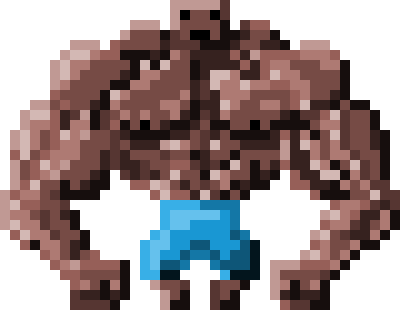

# PushyPixels

An isometric game written in love2D and lua

Punch your beefy opponents off screen to win the battle!

### Play it!
https://debuggerdave.itch.io/pushypixels

### Controls

## Player 1
    w = up
    a = left
    s = down
    d = right
    q = punch
    
    
## Player 2
    i = up
    j = left
    k = down
    l = right
    u = punch

## Player 3
    up = up
    left = left
    down = down
    right = right
    rctrl = punch

## Player 4
    numPad8 = up
    numPad4 = left
    numPad5 = down
    numPad6 = right
    numPad0 = punch
